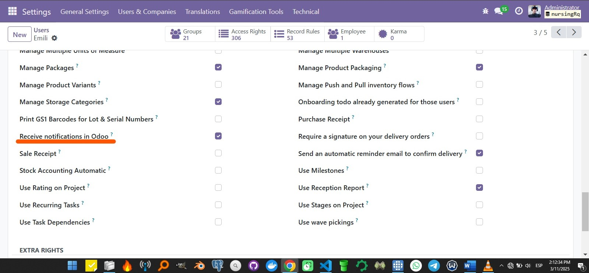
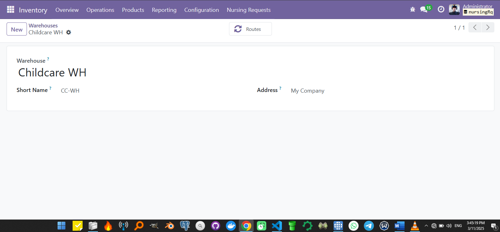

# Nursing Request Illustrated User Guide

## Settings

### User Settings > Users > Create User

General Settings Applied over user groups

- Define user's role(Nurse, Storekeeper)

- Grant access to base inventory module
    Admin: (Storekeeper,Manager)
    User: Nurse

- Assign an email and password to the user

### Preferences > Notification > Handle by Odoo

### General Settings > Inventory

Settings applied over Inventory module

- Enable packages inside the Operations section

- Enable product packagings in Products section

- Enable Storage Locations and Storage Categories in Warehouse section

### Inventory Settings > Warehouse Management

Settings applied over Inventory Warehouse section

- Create a new WH (Childcare WH)

- Create new internal locations (CC-WH/BaseStock)
    Child Medications: CC-WH/MedicationStock
    Medical Supplies:  CC-WH/SupplieStock

- Create new operation types (Receipts,Deliveries,Internals)

- Create Storage Categories(Child Meds, Dry and Cool, Medical Supplies)

- Create Putaway rules so when Product arrives to A when can relocate it to B

### Inventory Settings > Products

Settings applied over Inventory Products section

- Create Products categories (Child Meds and Medical Supplies under Nursing)

- Create Reordering Rules for Child Meds and Med Supplies with min and max qty per product      (Automatically Handled by Odoo)

- Assign a vendor to each order

### Inventory Settings > Deliveries

Settings applied over Inventory Deliveries section

- Create package types

## Users Workflow in the system

### Base Rules

1. All users must be internal users
2. All users must have its own related partner
3. All users must have an email assigned
4. All users must been able to receive Odoo notificactions.
5. All users must be active in the system

### Access and actions Rules

1. Storekeepers and Managers must have full access to Inventory

2. Nurses can only access and request medical supplies and medications from the menu

3. Nurses can only see their own NR

4. Nurses can edit its own NR while these are in Draft or Pending state
5. Nurses can cancel its own NR while these are in Draft or Pending states only

6. Nurses cant change the state of a NR once these is canceled or approved
7. Storekeepers and managers can see all NR and change its states from draft or pending to approved

8. Storekeepers can't approve an already approved or canceled NR

9. If the Storekeeper try to approve and NR with a product qty that exceed its stock, the NR automatically pass to Pending

10. When the stock is updated, storekeepers can again try to approve the NR
11. Storekeepers can see all NRL, filter and print them as they want

12. Storekeepers can manage and print the delivery orders related with the approved NRs

### Odoo Nofitications

- Nurse Notifications received:

- Approved NR notification sample:

